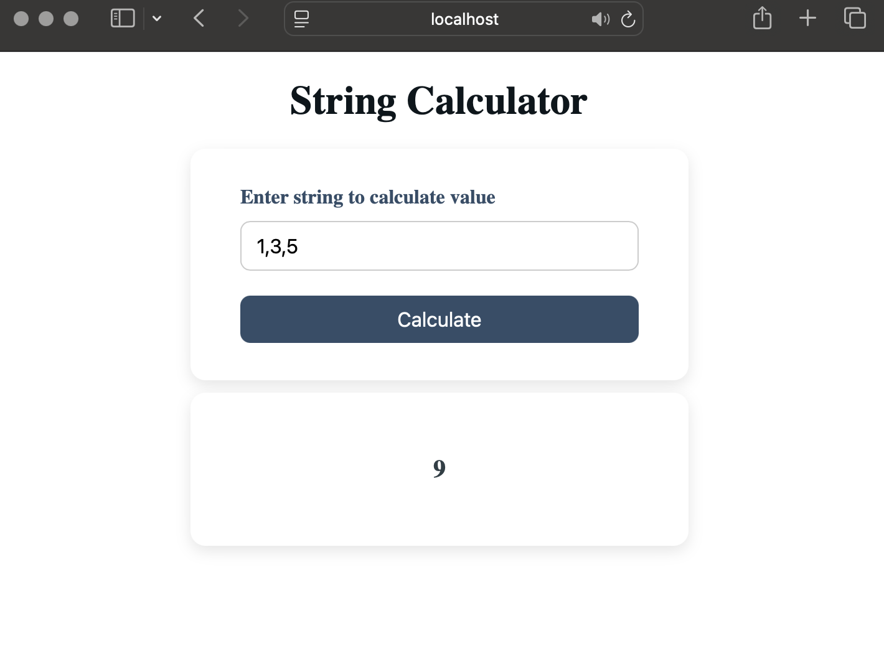
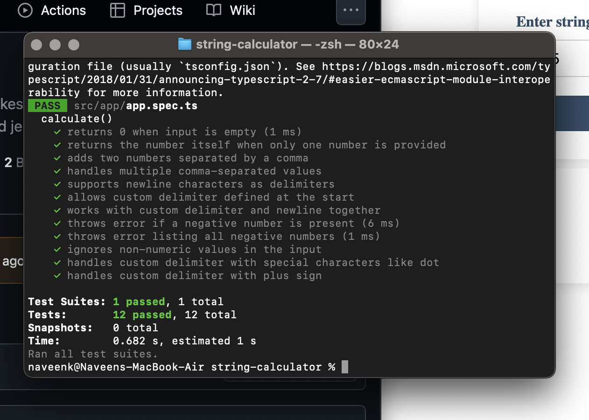

# 📊 String Calculator

This is a simple string calculator built with **TypeScript** and **Angular**, designed to parse a string of numbers and return their sum. It supports custom delimiters, newline characters, and throws errors for negative inputs. Unit tests are written using **Jest**.

---

## 🚀 Features

- Add comma-separated and newline-separated numbers
- Support for custom delimiters (e.g. `//;\n1;2`)
- Throws error for negative numbers with full list
- Clean UI built with Angular
- Jest-based test suite

---

## 🛠️ Project Setup

### 1. Clone the repository

```bash
git clone https://github.com/your-username/string-calculator.git
cd string-calculator
```


### 2. Install dependencies

```bash
npm install
```

### 3. Run Prject

```bash
ng serve
```

### 4. Run location

runs on http://localhost:4200

### 4. Run tests

```bash
npm test
```


